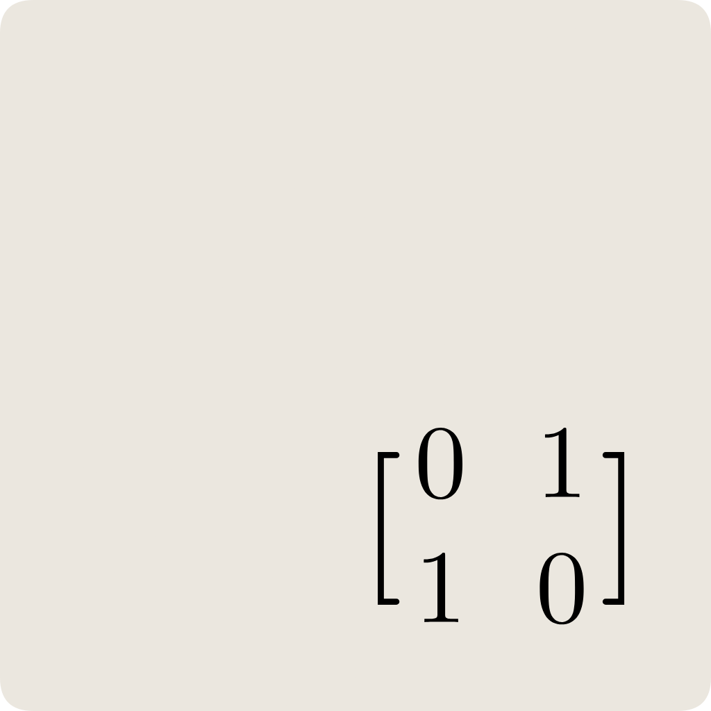

<p align="center">
    
</p>

<h1 align="center">C3E: Complex Compute Core Engine</h1>


The Complex Compute Core Engine (C3E) is a framework library developed in pure C, designed to enhance computational capabilities across various platforms. The library includes several distinct builds, each specifically developed for different use cases, making it a highly adaptable solution for both server computing, desktop and embedded systems. With C3E, developers can build powerful applications that efficiently utilize advanced computational resources, ensuring optimal performance and scalability.

C3E have a Debian package (*.deb) deployable on Debian-based operating systems. This build functions as a C/C++ library, providing developers with the functionality integrating C3E's capabilities directly into their applications. This library package ensures easy installation and compatibility with a wide range of systems, making it accessible to a broader audience. Developers can harness the power of C3E to enhance their software with advanced computational features, enabling applications to handle more complex tasks and deliver better performance.

## Use Cases

1. **Scientific Computing**

    - Scientists can run large-scale simulations for climate modeling, astrophysics, and molecular dynamics by utilizing the x86-based C3EPU. These simulations require immense computational power to process complex mathematical models and large datasets efficiently, ensuring accurate and timely results.

    - Researchers can analyze vast datasets, such as genomic data or particle physics data, using the C3EPU to perform complex calculations and pattern recognition tasks. This capability is crucial for making new scientific discoveries and advancing our understanding of various phenomena.

2. **Artificial Intelligence and Machine Learning**

    - The C3EPU can accelerate the training of deep learning models, providing the computational power needed for large datasets and complex architectures and algorithms. This acceleration is essential for reducing training times and improving model accuracy in fields such as image recognition, natural language processing, and autonomous systems.

    - Deploying the RISC-V based C3EPU in edge devices allows for efficient inference processing. This enables real-time AI applications, such as object detection, facial recognition, and speech recognition, to run locally without relying on cloud-based server resources, enhancing responsiveness and privacy.

    - With the ability to perform complex computations, IoT devices powered by C3E can make intelligent decisions and operate autonomously. This is particularly useful in applications like smart homes, industrial automation, and healthcare monitoring systems, where real-time data processing and decision-making are critical.

    - Robots equipped with C3E can process sensor data in real-time, enabling efficient path planning, obstacle avoidance, and decision-making for autonomous navigation. This is vital for applications in logistics, manufacturing, and exploration where robots need to operate independently in dynamic environments.

    - C3E can be used to enhance the capabilities of robotic vision systems. This allows robots to recognize objects, track movements, and interact with their surroundings more effectively, improving their utility in tasks like assembly, inspection, and service robots.

3. **Embedded Systems**

    - Embedded systems, such as those in automotive applications or industrial machinery, can leverage the RISC-V C3EPU to process data from sensors in real-time. This ensures precise control and monitoring, which is essential for maintaining safety, efficiency, and reliability in critical applications.

    - C3E can power wearable devices, providing the necessary computational resources for applications like health monitoring, fitness tracking, and augmented reality. These devices benefit from the low-power, high-performance capabilities of the C3EPU to deliver advanced features and functionalities.

4. **Gaming and Graphics**

    - Game developers can use C3E to create more realistic physics simulations, advanced AI behaviors, and detailed graphics rendering. This enhances the overall gaming experience by providing more immersive and interactive environments.

    - C3E can power Virtual Reality (VR) and Augmented Reality (AR) applications, providing the computational strength required for real-time rendering and interaction. This makes virtual experiences more immersive and responsive, essential for applications in entertainment, education, and training.

    - The C3E can also improve video editing and processing tasks by accelerating the rendering of high-resolution videos and complex effects. This capability is essential for producing high-quality multimedia content.

    - The framework can be used for real-time audio processing, improving the quality of sound in applications such as music production, broadcasting, and live performance. This ensures superior audio experiences for audiences.

## License

See [BSD 2-Clause License](https://opensource.org/license/bsd-2-clause).

```
Copyright 2024 Nathanne Isip

Redistribution and use in source and binary forms,
with or without modification, are permitted provided
that the following conditions are met:

1. Redistributions of source code must retain the
   above copyright notice, this list of conditions
   and the following disclaimer.

2. Redistributions in binary form must reproduce
   the above copyright notice, this list of conditions
   and the following disclaimer in the documentation
   and/or other materials provided with the distribution.

THIS SOFTWARE IS PROVIDED BY THE COPYRIGHT HOLDERS AND
CONTRIBUTORS “AS IS” AND ANY EXPRESS OR IMPLIED WARRANTIES,
INCLUDING, BUT NOT LIMITED TO, THE IMPLIED WARRANTIES OF
MERCHANTABILITY AND FITNESS FOR A PARTICULAR PURPOSE ARE
DISCLAIMED. IN NO EVENT SHALL THE COPYRIGHT HOLDER OR
CONTRIBUTORS BE LIABLE FOR ANY DIRECT, INDIRECT, INCIDENTAL,
SPECIAL, EXEMPLARY, OR CONSEQUENTIAL DAMAGES (INCLUDING,
BUT NOT LIMITED TO, PROCUREMENT OF SUBSTITUTE GOODS OR
SERVICES; LOSS OF USE, DATA, OR PROFITS; OR BUSINESS
INTERRUPTION) HOWEVER CAUSED AND ON ANY THEORY OF LIABILITY,
WHETHER IN CONTRACT, STRICT LIABILITY, OR TORT (INCLUDING
NEGLIGENCE OR OTHERWISE) ARISING IN ANY WAY OUT OF THE USE
OF THIS SOFTWARE, EVEN IF ADVISED OF THE POSSIBILITY OF SUCH
DAMAGE.
```